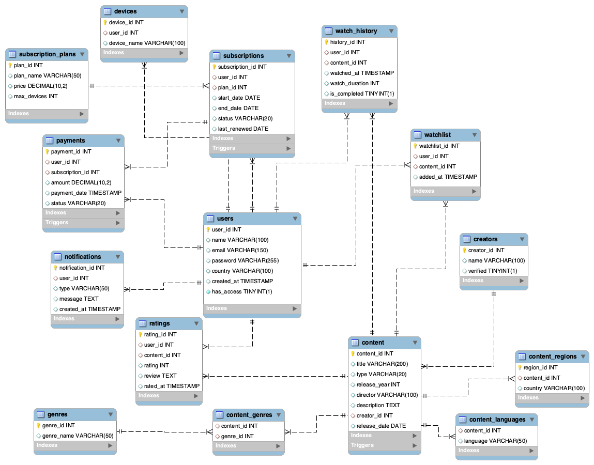

# 🎬 Netflix Streaming Platform Analytics Database

### Designing a Centralized Relational Database for Modern Streaming Platforms

### SQL-Based Database System for Managing Users, Subscriptions, Content, Watch History, Ratings, Payments, and Platform Analytics

  

---

## 🗂️ ER Diagram

  

---

## 📊 Database Overview

| Metric | Value |
|--------|------:|
| Database | MySQL |
| Tables | 16 |
| Business Queries | 25 |
| Database Triggers | 4 |
| Scheduled Events | 1 |
| Database Design | Third Normal Form (3NF) |

---

# 🎯 Business Problem

Streaming platforms manage millions of users, subscriptions, content libraries, watch history records, payments, and customer ratings every day. Managing these operations through disconnected systems or poorly designed databases can result in duplicate user records, inconsistent subscription data, inaccurate revenue reporting, inefficient content management, and limited business visibility.

This project was developed to design a centralized relational database that efficiently manages streaming platform operations while maintaining data integrity, supporting business analytics, and automating routine database processes.

The system addresses key business questions such as:

- Which movies and TV shows generate the highest audience engagement?
- Which subscription plans contribute the highest revenue?
- How do customer viewing patterns change over time?
- Which content requires quality improvements based on customer ratings?
- How can multilingual and regional content availability be optimized?
- How can customer engagement be improved through viewing behaviour analysis?
- How can subscription management and platform operations be automated efficiently?

---

# 📈 Executive Summary

The **Netflix Streaming Platform Analytics Database** was designed to centralize streaming platform operations by integrating user management, subscriptions, content catalog, multilingual availability, regional distribution, watch history, ratings, watchlists, payments, and creators into a single normalized relational database.

The system improves operational efficiency by reducing data redundancy, maintaining subscription consistency, organizing streaming content, and providing reliable reporting for business analysis. SQL-based business queries enable platform administrators to monitor subscriber activity, evaluate content performance, analyze viewing behaviour, track subscription trends, measure revenue, and support data-driven business decisions.

In addition, automated business rules help maintain database integrity by validating content records, activating subscriptions after successful payments, managing subscriber access, protecting creator information, and generating subscription renewal notifications.

Overall, the project demonstrates how a well-designed relational database can support scalable streaming platform operations by combining efficient data management, SQL-driven business analytics, and automated database workflows.

---

# 🔍 Business Query Analysis

| Business Area | Business Question | Business Value |
|--------------|-------------------|----------------|
| 👥 User Management | Analyze active and cancelled subscriber accounts. | Supports subscription lifecycle management and customer account monitoring. |
| 💳 Subscription Analytics | Analyze subscription cancellations over the latest six months. | Helps evaluate customer retention trends and subscription performance. |
| 💰 Revenue Reporting | Generate monthly subscription revenue reports. | Supports financial monitoring and business performance analysis. |
| 🎬 Content Performance | Identify the most-watched movies during the latest three months. | Measures content popularity and supports future content investment decisions. |
| 📺 Content Planning | Identify TV shows scheduled for release within the next six months. | Supports content release planning and promotional scheduling. |
| ⭐ Rating Analysis | Identify movies receiving consistently low customer ratings. | Helps improve content quality and audience satisfaction. |
| 🌍 Content Availability | Retrieve titles available in both English and Spanish. | Evaluates multilingual content availability across the platform. |
| 🎥 Creator Performance | Identify directors with the highest average content ratings. | Measures creator performance and supports future collaboration decisions. |
| 📑 Watchlist Analytics | Identify users with multiple unwatched titles in their watchlist. | Helps understand future viewing intent and user engagement opportunities. |
| ▶️ Viewing Behaviour | Identify users who partially watched multiple titles. | Analyzes content completion patterns and customer engagement. |
| 📈 User Engagement | Identify the most active users based on viewing activity. | Measures subscriber engagement and overall platform usage. |
| 📊 Genre Analysis | Analyze content distribution across different genres. | Supports content portfolio planning and genre investment decisions. |
| 🌐 Regional Availability | Analyze content availability across different regions. | Supports localization strategy and regional content planning. |
| 🌎 Language Analytics | Analyze the number of titles available in each language. | Helps evaluate language coverage and global audience reach. |
| 🔔 Customer Notifications | Identify users approaching subscription expiry. | Supports renewal campaigns and improves customer retention. |

---

# ⚙️ Business Automation

| Business Rule | Business Value |
|--------------|----------------|
| 💳 Subscription Status Automation | Automatically activates customer subscriptions after successful payment, ensuring uninterrupted access to streaming services. |
| 🚫 Subscriber Access Management | Automatically revokes platform access when a subscription is cancelled, ensuring only active subscribers can access premium content. |
| ✅ Content Validation | Validates essential content information before new titles are added, maintaining accurate and complete content records. |
| 🎬 Creator Verification | Restricts content modifications to verified creators, protecting the integrity of the streaming content catalog. |
| 🔔 Subscription Expiry Notifications | Automatically generates reminders before subscription expiry, encouraging timely renewals and improving customer retention. |

---

# ⭐ Key Features

- User & Subscriber Management
- Subscription Plan Management
- Content Catalog Management
- Watch History Tracking
- Ratings & Reviews Management
- Watchlist Management
- Multilingual Content Support
- Regional Content Availability
- Revenue & Payment Tracking
- Business Reporting & SQL Analytics
- Database Automation using Triggers & Events
- Data Integrity & Validation

---

# 💡 Project Outcomes

- Designed a centralized relational database for managing end-to-end streaming platform operations.
- Improved data consistency through normalized database design and structured relational modeling.
- Developed SQL queries to support business reporting, content analytics, subscription analysis, and revenue monitoring.
- Implemented automated business rules using triggers and scheduled events to improve operational efficiency and maintain data integrity.
- Demonstrated how relational databases can streamline streaming platform workflows and support data-driven business decision-making.
